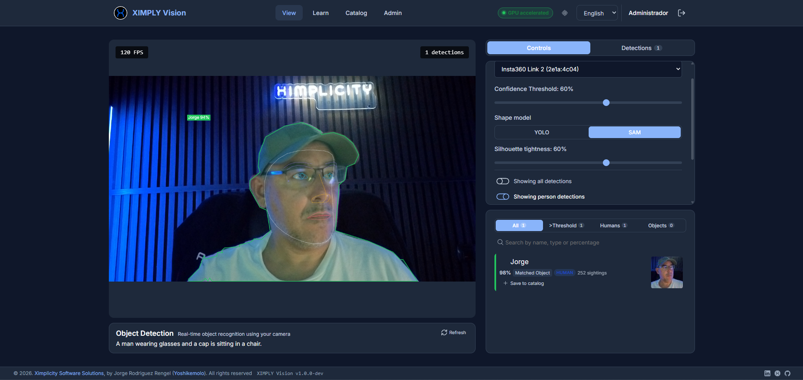
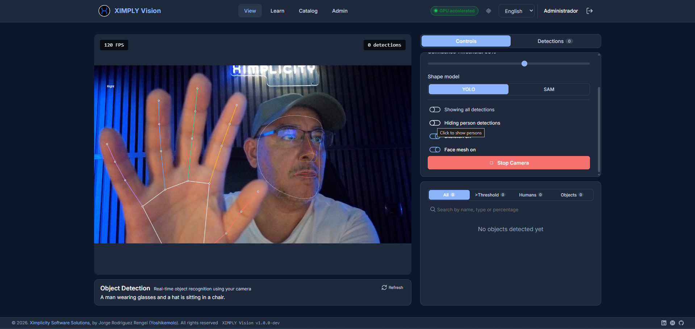

# XIMPLY Vision

Real-time computer vision that learns your own objects and people, and runs entirely on
your machine.

XIMPLY Vision takes any video source, detects what is in front of it, and matches what
it sees against a catalog you built yourself. It recognises people it has met before and
calls them by name, traces the real outline of an object rather than a box around it,
reads barcodes and QR codes, draws body, hand and face wireframes, and writes a sentence
describing the scene whenever the scene changes.

Nothing leaves the machine. Every model runs locally: no cloud service, no API key, no
token, no per request billing, and no frame sent anywhere. The whole thing is open source
and free to use.



*A person the application has met before, matched at 98 percent and shown by name. The
green outline is the real silhouette rather than a bounding box, and the face mesh is
drawn over it.*

## What it does

**Teaches itself your catalog.** The detector knows the eighty generic classes it was
trained on, which is rarely what you care about. Point the camera at your own object,
name it, and it is recognised from then on. Two ways to teach it, and they can be mixed
on the same entry:

- **Upload a gallery.** Drop in images in any common format, draw a box around the thing
  that matters, and add the metadata you need: description, reference, weight,
  dimensions, price, colour and materials.
- **Capture live.** Point the camera at the object and save the detection straight into
  the catalog. Retrain later by adding more views of the same entry, from either source.

**Recognises people, not just bodies.** A face seen for the first time becomes "Person 1"
and is remembered. Rename it and the name follows that person from then on. Two
fingerprints are stored per person because each covers the other's blind spot: the face
embedding survives a change of clothes and a different camera but degrades behind a mask,
while the body embedding is unaffected by a cap, glasses or a mask and works from behind,
but does not survive a change of clothes. People live in their own **People** category,
kept apart from objects.

**Sees more than boxes.** Bounding boxes are the floor, not the ceiling:

- **Silhouettes** through Segment Anything, prompted with the detector's own boxes, with
  a slider that controls how tightly the outline hugs the subject.
- **Skeletons** for bodies and hands: 33 body landmarks and 21 per hand, enough to read
  a gesture rather than just locate a wrist.
- **Face mesh**, 478 landmarks drawn as feature contours or as the full low polygon mesh.
- **Barcodes and QR codes**, read from the same frame as everything else.



*Hand landmarks, coloured per finger, and the facial feature mesh. The overlays are
toggled independently and switching one off stops the work rather than hiding it.*

**Reacts when the scene changes.** A face the camera has never seen is enrolled on the
spot: a catalog entry is created, named "Person 1", "Person 2" and so on, and the crop
from that frame is stored as their portrait. Every later sighting is scored, and the
portrait is replaced whenever a clearer one appears, so the entry settles on a picture
with a visible face rather than the blurred back view it happened to start from. The
same happens for an object you save from the live view.

**Describes what it sees.** A vision language model writes a sentence about the scene,
using the detections as context so it refers to people by the names in your catalog. It
rewrites itself when the scene changes, keyed on what is present rather than on pixels,
so moving about leaves it alone while someone walking in does not.

**Tells other systems what it saw.** Every arrival, departure and change of scene is
recorded as an event and pushed to whoever subscribed to it, so another system can act
on a person being enrolled or a known object appearing without polling for it. Events are
raised on a transition and never per frame: a person who walks in and stays for ten
minutes produces one event, not three thousand. Each one is stored as an OpenTelemetry
log record, so a collector or log backend reads it with no translation layer, and the
frame that raised it is kept with it. Deliveries are signed with HMAC-SHA256 using a
secret unique to each subscription, retried with a backoff, and an endpoint that keeps
failing is switched off rather than retried forever. A subscription can ask for one event
type or a whole family. The same events can be read back over the API, including an OTLP
export at `/api/v1/events/otlp`.

**Streams what it is seeing.** A webhook needs the receiver to be a server. This
does not: something connects to the instance instead. `/api/v1/stream/events` is
server sent events over the same records, so `curl -N` and a token are enough to
watch arrivals as they happen, and `/api/v1/stream/camera/{id}` is a multipart
JPEG stream that `ffplay` and any player already read. The same records are
also published to an MQTT broker, where `mosquitto_sub` reads them without any
code being written. Live frames and the broker are off until a deployment turns
them on, and watching a camera needs a scope written on the token by name:
looking at a room is a different act from reading a record of one.

**Answers an agent's questions.** A webhook tells a system what happened; it cannot be
asked anything. So the same observations are also served over a Model Context Protocol
server, mounted at `/mcp`, where an assistant can ask what happened this morning, who is
in front of the camera now, which people and objects this instance knows, and whether the
models are running on the GPU. Every tool reads and none of them writes: an agent
connected to a camera should not be able to rename a person or empty the catalog because
of a sentence it was fed. Access is a scoped token issued per client, shown once and
revocable on its own, not a borrowed user session.

**Runs on your hardware.** Object detection, face recognition and segmentation move onto
an NVIDIA GPU when there is one, and fall back to the processor when there is not, with
no flag to set either way. A badge in the header says which is happening, and opens a
panel with a switch for each of the three parts: detection, face recognition, and the
skeleton and mesh overlays. They move independently and they move while the server is
running, so working out whether the GPU is helping a particular part is one click rather
than an environment variable and a restart.

**Knows who is using it.** Registration and login, several users, and role based access
control, so who can view, teach, edit the catalog or manage users is a decision you make
rather than something everyone shares.

**Takes any video source.** Every camera the system exposes is listed and selectable:
the built in webcam, a USB camera, or a capture device.

## Features

- **View**: live detection with labels and confidence, catalog and person matches,
  silhouettes, skeletons, face mesh, barcode reading and the scene description.
- **Learn**: teach new objects and people from uploaded galleries or live capture, with
  annotation tools and rich metadata.
- **Catalog**: full CRUD over learned entries, retraining with new images, merging
  duplicates, bulk delete, inline renaming, search and filtering, with People kept in
  their own category.
- **Admin**: user management with role based access control.
- **Events and webhooks**: arrivals, departures and scene changes recorded as
  OpenTelemetry log records, readable over the API and delivered to signed webhook
  subscriptions.
- **Streaming**: an event stream and a live camera stream held open over HTTP,
  and the same records published to an MQTT broker, for a subscriber that would
  rather connect than run a receiver. See
  [FEAT-0015](doc/features/FEAT-0015-streaming.md).
- **Integrations**: a page for connecting this instance to other systems. Register a
  webhook client, filter which events it receives, send it a signed test delivery,
  rotate its secret and watch its delivery health; or issue a scoped token for an agent
  and copy the configuration for the client you use. Ready to paste receivers for
  Node.js, NestJS, Python, Java Spring and .NET 9 come with it, each verifying the
  signature before trusting the body. A streaming tab does the same for the
  stream: whether the broker is connected, the topic tree it publishes on, and
  `mosquitto_sub`, `curl` and `ffplay` commands built from the address the
  browser is using, alongside Angular, React and plain JavaScript clients.
- **i18n and theming**: English and Spanish, dark and light themes.

## Requirements

- Docker Engine 24 or later with the Compose v2 plugin (`docker compose version`)
- Roughly 6 GB of free disk space for images, model weights and volumes
- A video source: the built in webcam, a USB camera or a capture device
- A browser that grants camera access to `http://localhost`
- Optionally an NVIDIA GPU, which the application uses when it finds one

Nothing else is needed. Python, Node and the ML dependencies all live inside the images.

## Install with Docker

```bash
git clone https://github.com/Yoshikemolo/ximply-cv.git
cd ximply-cv
docker compose up -d --build
```

That is the whole install. The first build takes several minutes because it compiles the
Python ML stack and builds the Angular bundle. The stack starts without a `.env` file:
every variable falls back to a working local default.

Then open:

| Service       | URL                                | Notes                       |
| ------------- | ---------------------------------- | --------------------------- |
| Application   | http://localhost:4200              | Main entry point            |
| API docs      | http://localhost:8000/api/v1/docs  | Swagger UI                  |
| API redoc     | http://localhost:8000/api/v1/redoc | ReDoc                       |
| MinIO console | http://localhost:9001              | `minioadmin` / `minioadmin` |

Sign in with the seeded administrator:

```
Email:    admin@ximply.com
Password: Admin1234
```

Change that password from the Admin section right after the first login.

### What happens on first start

The backend bootstraps itself: it creates the database schema, seeds permissions, roles
and the administrator user, and creates the MinIO bucket. YOLO weights are downloaded on
first detection into a named volume, so later restarts are fast.

### Customising the install

Copy the template and edit what you need:

```bash
cp .env.example .env
docker compose up -d --build
```

`.env.example` documents every variable: host ports, database and MinIO credentials, the
JWT secret, and which YOLO model to load (`yolo11n` through `yolo11x`).

### Everyday commands

```bash
docker compose logs -f backend     # follow backend logs
docker compose ps                  # service status
docker compose restart backend     # restart one service
docker compose down                # stop the stack, keep the data
docker compose down -v             # stop and delete all data volumes
```

### Development mode

Hot reload for the backend, development build for the frontend:

```bash
docker compose -f docker-compose.yml -f docker-compose.dev.yml up -d --build
```

### GPU acceleration

Detection runs on the CPU by default and needs no configuration. On a machine
with an NVIDIA GPU and the NVIDIA Container Toolkit installed, add the GPU
override to move object detection and face recognition onto it:

```bash
docker compose -f docker-compose.yml -f docker-compose.gpu.yml up -d --build
```

Check the toolkit is in place first:

```bash
docker run --rm --gpus all nvidia/cuda:12.4.0-base-ubuntu22.04 nvidia-smi
```

The application shows a badge on its main page when acceleration is active.
Opening it names the device and gives each backend a switch, so detection, face
recognition and the landmark overlays can be moved between the GPU and the
processor without restarting anything. The models affected rebuild on the next
frame. Changing a switch needs the `detection:configure` permission and applies
to the whole server; reading the same state needs nothing and is also available
at `/api/v1/health/acceleration`.

The skeleton and mesh overlays start on the processor even where the GPU is
available, because their delegate needs a real graphics context that a container
usually lacks. `ACCELERATION_MEDIAPIPE_GPU` sets where they start; the switch in
the panel is how to try them on the GPU on a machine that can provide one.

The override is a separate file because reserving a GPU device fails outright on
a machine without one, and it is still what puts a device inside the container:
the switches decide how an accelerator is used, not whether there is one. The
backend needs no flag either way: it probes the hardware at startup and falls
back to the CPU on its own.

### Streaming and the broker

The event stream needs no configuration: hold a connection open on
`/api/v1/stream/events` with a token and read events as they are raised. Live
camera frames and the MQTT broker are switched on separately, because they carry
the room rather than a record of it. The broker sits behind a Compose profile:

```bash
docker compose --profile broker up -d
```

Then set `MQTT_ENABLED=true` in `.env`, and `CAMERA_VIEW_ENABLED=true` if a
client should be able to watch a camera, and restart the backend. The shipped
broker has no TLS and no per-account topic rules, so its port belongs on the
loopback address; what else has to be in place is in
[SEC-0011](doc/sec/SEC-0011-broker-and-live-frame-exposure.md).

### Production mode

Resource limits, log rotation and no debug. This override has no fallback defaults, so a
`.env` file with real credentials is required:

```bash
cp .env.example .env
docker compose -f docker-compose.yml -f docker-compose.prod.yml up -d --build
```

Set a real `JWT_SECRET_KEY` and real database and MinIO credentials before exposing the
stack. Camera access also requires a secure context: on anything other than `localhost`,
serve the frontend over HTTPS or the browser will refuse to open the camera.

## Running without Docker

### Backend

```bash
cd backend
python -m venv .venv
source .venv/bin/activate
pip install -e ".[ml,dev]"
uvicorn app.main:app --reload
```

On Windows, activate with `.venv\Scripts\activate` instead. A reachable PostgreSQL and
MinIO are required; point `DATABASE_URL` and `MINIO_ENDPOINT` at them through
`backend/.env`.

### Frontend

```bash
cd frontend
npm install
npm start
```

## The models, and what each one is for

Every model below runs locally. Weights are downloaded once on first use and cached in a
volume; after that the application works with no network at all.

| Model | Job | Why this one |
| --- | --- | --- |
| **YOLO11** | Finds things and says what class they are | Fast enough for live video and the only model here that produces a label. Everything else refines or describes what it found |
| **ORB features** | Matches a detection against your catalog of objects | Classical descriptors, no training step: add photos of an object and it is recognisable immediately, rather than after a fine tuning run |
| **InsightFace, ArcFace** | Face embedding, the identity of a person | Survives a change of clothes, a different camera and a different day, which is what carries a name across sessions |
| **ResNet50 backbone** | Body embedding, appearance of a whole person | Works behind a cap, glasses or a mask, and from behind, where a face model has nothing to look at |
| **Segment Anything 2.1** | The exact outline of a detected object | Turns a rectangle into a silhouette. It cannot classify, so it is prompted with the detector's boxes and never replaces it |
| **MediaPipe Pose** | 33 body landmarks | Denser than the classic 17 point layout: feet gain a heel and a toe, wrists gain finger anchors, so the arm continues into the hand |
| **MediaPipe Hands** | 21 landmarks per hand | The body model only anchors the wrist. This is what carries a gesture |
| **MediaPipe Face Landmarker** | 478 face landmarks | Feature contours or the full low polygon mesh, drawn over the face |
| **pyzbar, ZBar** | Barcodes and QR codes | Reads the code from the same frame as everything else, no separate mode to switch into |
| **SmolVLM2** | Writes the scene description | Small enough to sit alongside the others on one GPU, and takes an arbitrary prompt, so the detections can be fed to it as context |

Object detection, face recognition, segmentation and the scene description run on an
NVIDIA GPU when one is available. The landmark models start on the processor and can be
moved from the panel behind the badge, on a machine whose graphics stack supports their
delegate. Feature matching and barcode reading stay on the processor, which is where
they are cheapest.

## Technology stack

| Layer           | Technology                                               |
| --------------- | -------------------------------------------------------- |
| Backend         | Python 3.11, FastAPI, SQLAlchemy async, Pydantic v2       |
| Computer vision | Ultralytics YOLO11 and SAM 2.1, MediaPipe, InsightFace, OpenCV, pyzbar |
| Language model  | SmolVLM2 through Transformers, running locally            |
| Database        | PostgreSQL 16                                             |
| Object storage  | MinIO                                                     |
| Frontend        | Angular 19 standalone components, Signals, SCSS           |
| Auth            | JWT with refresh rotation and RBAC                        |
| Infrastructure  | Docker Compose, Nginx, Mosquitto when the broker is on, CUDA when present |

## Project structure

```
ximply-cv/
├── backend/          FastAPI application
├── frontend/         Angular 19 application
├── docker/           Dockerfiles and nginx configuration
├── doc/              Architecture, API and feature documentation
├── planning/         Milestones
├── postman/          API collection
└── models/           ML model weights
```

## Documentation

- [Features](doc/features/README.md), one document per feature: what it does,
  how it was built, and the patterns behind it
- [Architecture decisions](doc/adr/README.md), each decision with its context
  and what it costs
- [Security decisions](doc/sec/README.md), including the gaps, and what must be
  changed before exposing the stack beyond localhost
- [System architecture](doc/infrastructure/architecture.md)
- [API reference](doc/infrastructure/api.md)
- [Deployment guide](doc/operations/deployment.md)

The event and integration layer runs across several of those: what is raised and
delivered in [FEAT-0013](doc/features/FEAT-0013-events-and-webhooks.md), the page that
manages it in [FEAT-0014](doc/features/FEAT-0014-integrations.md), the decisions behind
it in [ADR-0013](doc/adr/ADR-0013-events-as-opentelemetry-records.md) through
[ADR-0017](doc/adr/ADR-0017-scoped-tokens-for-machine-clients.md), and the credential
handling in [SEC-0008](doc/sec/SEC-0008-webhook-signing.md) and
[SEC-0009](doc/sec/SEC-0009-integration-tokens.md). Streaming is
[FEAT-0015](doc/features/FEAT-0015-streaming.md), the decisions behind it are
[ADR-0022](doc/adr/ADR-0022-carry-the-live-stream-on-a-broker-and-a-socket.md),
[ADR-0023](doc/adr/ADR-0023-a-live-frame-is-never-stored-and-never-implied.md),
and what running a broker and showing a live room expose is
[SEC-0011](doc/sec/SEC-0011-broker-and-live-frame-exposure.md).

All API endpoints are versioned under `/api/v1/`, apart from the protocol mounts at
`/mcp` and `/mcp/sse`, which the protocol places at the root.

## Troubleshooting

**The camera does not open.** Grant camera permission in the browser and use
`http://localhost:4200`. Any other host needs HTTPS.

**Port already in use.** Copy `.env.example` to `.env` and change `FRONTEND_PORT`,
`BACKEND_PORT`, `DB_PORT` or `MINIO_PORT`.

**The backend restarts on startup.** Check `docker compose logs backend`. It usually
means PostgreSQL or MinIO is not healthy yet; the backend waits for both health checks.

**Detection is slow.** Switch to a lighter model with `DETECTION_MODEL=yolo11n` in
`.env`, then rebuild.

**Starting from scratch.** `docker compose down -v` removes the database, the stored
images and the downloaded weights.

## Planned

- **A screen for events**, so what was observed can be browsed without an API client

## Contributing

See [CONTRIBUTING.md](CONTRIBUTING.md) for the full guide.

1. Branch off `main`.
2. Follow the conventions in [CONTRIBUTING.md](CONTRIBUTING.md): Conventional Commits,
   written in English.
3. Run the tests: `pytest` in `backend/` or `docker compose exec backend pytest`,
   and `npm test` in `frontend/`.
4. Open a pull request.

## License

Released under the [MIT License](LICENSE).

## Author

Jorge Rodríguez - Yoshikemolo
